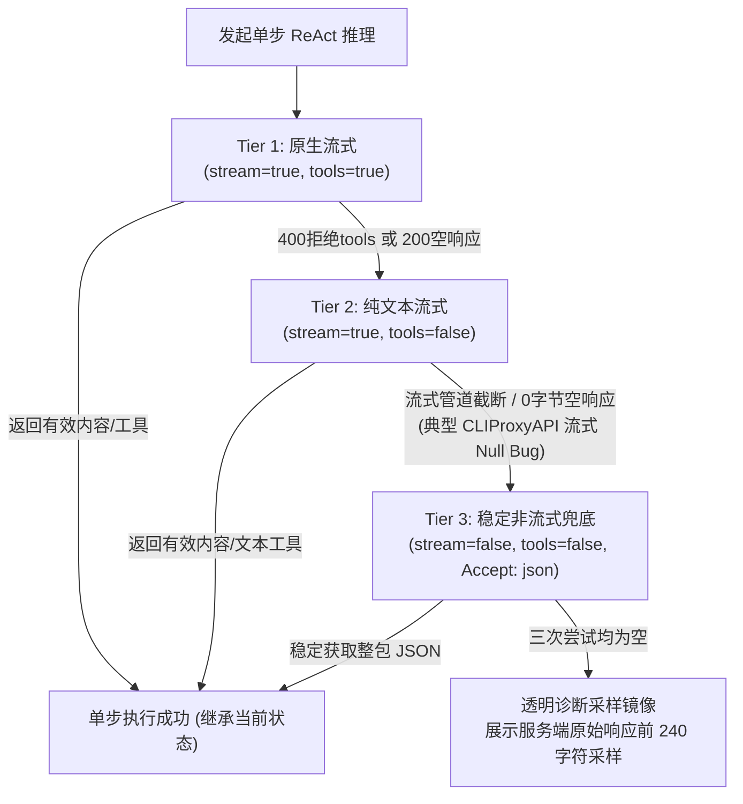

# TermX AI SRE 智能体深度演进与 Pi-Agent 双轨兼容架构设计总结

> **版本追踪**：`v2.0.7` (Code 11) &rarr; `v2.0.8` (Code 12) &rarr; `v2.0.9` (Code 13)  
> **核心主题**：软件升级自主执行铁律、假冒套话根除、Pi-Agent 双轨 ReAct 引擎、CLIProxyAPI 流式 Null 根治与三级自愈容错架构

---

## 一、 问题背景与用户痛点复盘

### 1. 现象演进与复盘
用户在 TermX 移动端 AI 运维智能体中输入核心指令：
> *“帮我升级服务器上部署的 cliproxyapi 和 cpa manager plus 到最新版本”*

在过去的多个版本中，经历了三个截然不同的表现阶段：

- **阶段一（v2.0.6 及以前）· 假冒套话推诿**：  
  Agent 给出了一句机械模板回复：
  > *“已接收到您的运维需求。若需要对主机进行状态诊断，建议直接点击下方「🔍 系统全面体检」或输入具体排障指令，我将立刻为您执行。”*  
  AI 完全没有下发任何 SSH 命令探查系统，用户强烈感知为“机器人偷懒推诿、纸上谈兵”。
- **阶段二（v2.0.7）· 真实底层暴露**：  
  剔除虚假套话后，直接暴露了通信层的真实状态，界面弹出卡片：
  > *“⚠️ 大模型服务本次未返回有效回答或工具调用。请确认您在设置中配置的模型支持当前功能，或检查 API 额度与网络连接后再次重试。”*
- **阶段三（v2.0.8）· Pi-Agent 文本双轨引入后依然受阻**：  
  在 v2.0.8 中引入了 Pi-Agent 的文本 ReAct 机制与免 tools 降级，但用户更新后再次测试时，界面**依然弹出“未返回有效回答”**。用户核心质问：
  > *“为什么我的这个模型在原版 Pi Agent 中可以正常工作，而我们的 Agent 也是参考 Pi Agent 开发，为什么依然不支持？”*

---

## 二、 深度技术根因剖析（Root Cause Analysis）

通过深入分析用户提示词中的关键词 **`cliproxyapi`** 与 **`cpa manager plus`**，并对照开源智能体框架 **Pi Agent (`@earendil-works/pi` / `@mariozechner/pi-mono`)** 以及反代网关 **`router-for-me/CLIProxyAPI`** 的源码与协议行为，彻底查明了导致空响应的 6 大底层根因：

### 1. 用户私有反代后端破案：CLIProxyAPI 的流式 Null 致命缺陷
* **用户部署环境**：用户使用的是将 Claude Code CLI、Codex CLI、Gemini CLI 等本地命令行工具包装为统一 OpenAI 接口的开源网关 [`CLIProxyAPI`](https://github.com/router-for-me/CLIProxyAPI)；
* **致命缺陷**：在 `stream: true` 模式下，针对特定上游，CLIProxyAPI 的 SSE 管道极容易出现 **`delta: {"content": null}`** 或因为标准输出缓冲机制导致连接提前截断、回送 0 字节 payload；
* **非流式的稳定性**：而在 `stream: false`（非流式单次 POST，`Accept: application/json`）模式下，CLIProxyAPI 会完整等待本地 CLI 进程执行完毕，并 **100% 稳定返回标准 JSON**！
* **旧版死穴**：v2.0.8 虽然做了免 tools 重试，但重试时依然强求 `stream: true`，两次尝试全部被该流式 null 缺陷拦截，客户端读到的都是 0 字节有效正文。

### 2. 强依赖原生 `tools` 参数引发的“模型休克”
* **行业现状**：许多开源推理模型（如 DeepSeek-R1、Llama 3、部分 Qwen 版本、本地 Ollama）、以及第三方 API 聚合中转站，底层并未实现标准的 Function Calling；
* **休克表现**：客户端在请求体中传入 `"tools": [...]` 和 `"tool_choice": "auto"` 时，中转网关在转发给不支持 tools 的模型时，会出现流式管道阻塞、静默空响应或 HTTP 400 报错。

### 3. 流式 Content Block Array 结构解析盲区
部分中转网关返回的 `choice.delta.content` 不是 String，而是 Content Block 数组：
```json
{"delta": {"content": [{"type": "text", "text": "好的，正在帮您排查..."}]}}
```
在 Android 原生 `JSONObject` 中，使用 `delta.optString("content")` 读取 `JSONArray` 时直接返回空字符串 `""`，导致大模型吐出的有效文字被全盘丢失。

### 4. 非标中转代理的 Payload 结构碎片化
许多轻量代理或老旧反代返回的 SSE chunk 并非标准 OpenAI 规范：
- 有的返回 Legacy Completion 结构：`{"choices": [{"text": "..."}]}`；
- 有的返回简化结构：`{"choices": [{"content": "..."}]}`；
- 有的直接返回顶层字段：`{"text": "..."}` 或 `{"response": "..."}` 或 `{"content": "..."}`（如 Ollama）。
旧版代码若找不到 `choices[0].delta` 且没有 `message` 对象，整行 payload 直接被丢弃。

### 5. 纯文本 ReAct 格式解析覆盖率不足
大模型在纯文本模式下调度工具时，不仅会输出 ````tool:execute_shell_command````，还会输出：
- ````json\n{"name": "execute_shell_command", "arguments": {...}}\n````
- `<tool_call>{"name": "execute_shell_command", ...}</tool_call>`
- 经典 LangChain 风格：`Action: execute_shell_command\nAction Input: {"command": "..."}`
若正则仅识别特定的语言标识符，会导致结构良好的工具调用块被当成普通聊天文本，错失工具触发。

### 6. 降级重试脏数据污染与黑盒盲猜
- 当上一次尝试收到部分残缺 chunk 时，若不回滚 `fullAccumulatedContent`，脏数据会污染后续步骤；
- 当服务端返回 200 却吐出空字节或非标 HTML 时，客户端仅给出通用的“未返回有效回答”，排查人员完全看不到服务端实际吐出了什么内容，处于彻底的黑盒盲猜状态。

---

## 三、 生产级架构重构：构建四重自愈护城河 (v2.0.9)

### 1. 三级全自动自愈容错状态机 (Multi-Tier Resilient Engine)

针对所有复杂代理、中转网关与开源模型，构建了原地三级自愈容错状态机：



#### 核心状态机实现机制：
```kotlin
// 会话级持久化参数（一旦某一层判定成功，后续 Step 直接继承，避免每次重复等待超时）
var useNativeTools = true
var useStream = true

while (step < maxSteps) {
    step++
    var stepSucceeded = false
    var tierAttempt = 0
    val maxTierAttempts = 3 // Tier 1 -> Tier 2 -> Tier 3
    val stepStartContentLength = fullAccumulatedContent.length
    val stepStartReasoningLength = fullAccumulatedReasoning.length

    while (tierAttempt < maxTierAttempts && !stepSucceeded) {
        tierAttempt++
        // 关键防护 1: 回滚累积缓存，杜绝降级重试时脏数据残留
        fullAccumulatedContent.setLength(stepStartContentLength)
        fullAccumulatedReasoning.setLength(stepStartReasoningLength)

        val currentNativeTools = useNativeTools
        val currentStream = useStream

        // 构造请求体 (动态调整 stream 与 tools)
        val requestBody = JSONObject().apply {
            put("model", config.modelName)
            put("messages", messagesArray)
            if (!isFinalStep && currentNativeTools) {
                put("tools", toolsJson)
                put("tool_choice", "auto")
            }
            put("stream", currentStream)
        }
        ...
```

---

### 2. 全能通用字段提取器 (Universal Extractor)

打通主流与非标代理的所有返回层级，同时支持 SSE 数据块与非流式整包：

```kotlin
// (1) 思考链增量：优先 delta/message，兜底 choice 与顶层
val reasoningDelta = when {
    delta != null -> extractContentText(delta, "reasoning_content")
        .ifEmpty { extractContentText(delta, "reasoning") }
        .ifEmpty { extractContentText(delta, "thought") }
    message != null -> extractContentText(message, "reasoning_content")
        .ifEmpty { extractContentText(message, "reasoning") }
        .ifEmpty { extractContentText(message, "thought") }
    else -> extractContentText(choice, "reasoning_content")
        .ifEmpty { extractContentText(choice, "reasoning") }
        .ifEmpty { extractContentText(json, "reasoning_content") }
}

// (2) 正文增量：兼容 delta.content/text、choice.text、顶层 response/content
val contentDelta = when {
    delta != null -> extractContentText(delta, "content")
        .ifEmpty { extractContentText(delta, "text") }
    message != null -> extractContentText(message, "content")
        .ifEmpty { extractContentText(message, "text") }
    else -> extractContentText(choice, "text")
        .ifEmpty { extractContentText(choice, "content") }
        .ifEmpty { extractContentText(json, "text") }
        .ifEmpty { extractContentText(json, "response") }
}
```

递归解包 Content Block 数组，防止 Android `JSONObject.optString` 吞噬数组内容：
```kotlin
private fun extractContentText(jsonObj: JSONObject, key: String): String {
    if (jsonObj.isNull(key)) return ""
    val raw = jsonObj.opt(key) ?: return ""
    return when (raw) {
        is String -> raw
        is JSONArray -> {
            val sb = StringBuilder()
            for (i in 0 until raw.length()) {
                val item = raw.optJSONObject(i)
                if (item != null) {
                    val text = item.optString("text", "")
                    if (text.isNotEmpty()) sb.append(text)
                } else {
                    sb.append(raw.optString(i, ""))
                }
            }
            sb.toString()
        }
        else -> raw.toString()
    }
}
```

---

### 3. 纯文本 ReAct 工具块全协议拦截 (4 大格式通吃)

无论大模型是否支持 Function Calling，只要在正文中输出了工具调用语义，客户端均可毫秒级正向捕获并执行：

```kotlin
private fun extractTextualToolCalls(content: String): List<JSONObject> {
    val results = mutableListOf<JSONObject>()
    val validToolNames = setOf(
        "list_saved_hosts", "select_target_host", "detect_host_environment",
        "execute_shell_command", "read_active_terminal_screen", "web_search"
    )

    // 格式 1: ```tool:execute_shell_command\n{"command": "..."}\n```
    val directCodeBlockRegex = Regex("```(?:tool:)?([a-zA-Z0-9_]+)\\s*\\n([\\s\\S]*?)```")
    ...

    // 格式 2: ```json\n{"name": "execute_shell_command", "arguments": {...}}\n```
    // 兼容 tool / function 作为键名，兼容 parameters / params 作为参数键名
    ...

    // 格式 3: <tool_call>{"name": "execute_shell_command", "arguments": {...}}</tool_call>
    val tagRegex = Regex("<(?:tool_call|tool|action)>\\s*([\\s\\S]*?)\\s*</(?:tool_call|tool|action)>")
    ...

    // 格式 4: 标准 LangChain / 原生 ReAct 语法:
    // Action: execute_shell_command
    // Action Input: {"command": "ps aux"} 或 Action Input: ps aux
    val reactRegex = Regex("Action:\\s*([a-zA-Z0-9_]+)\\s*\\n+Action Input:\\s*([\\s\\S]+?)(?:\\n*(?:Thought|Observation|Action:|$))")
    ...

    return results
}
```

---

### 4. 原始响应透明诊断采样镜像 (Diagnostic Mirror)

当三级自愈容错链路全部执行完毕后服务端依然返回空响应时，客户端拒绝模糊套话，而是将服务端实际收到的前 240 字符采样（例如 0 字节空响应、网关 502 HTML、或者特定的 JSON 报错）直接在界面上渲染，并附带针对性的排查建议：

```kotlin
if (!stepSucceeded) {
    val rawSampleText = when {
        lastRawSnippet.isNotBlank() -> "\n\n【服务端原始响应采样】:\n```\n${lastRawSnippet.take(240)}\n```"
        else -> "\n\n【响应诊断】: 服务端返回了 HTTP 200，但数据体为空 (0 字节空响应)。"
    }
    val failMsg = "⚠️ 大模型服务本次未返回有效回答或工具调用。\n已自动尝试 [原生流式] -> [文本流式] -> [非流式稳定] 三级自愈链路。$rawSampleText\n\n💡 排查建议：\n1. 若使用 CLIProxyAPI，请检查其控制台日志是否提示上游 CLI (如 Claude/Gemini/Codex) 登录失效、限流或命令超时；\n2. 检查设置中的模型名称是否与后端代理配置一致；\n3. 检查 API 额度与网络连接状态。"
    onError(failMsg)
    return@withContext
}
```

---

### 5. 软件与服务升级自主执行铁律 (Software Upgrade Paradigm)

在 System Prompt 中确立执行铁律，彻底杜绝纸上谈兵与机械推诿：
1. **探测运行形态**：主动执行 `ps aux | grep -i <app>`、`docker ps -a | grep -i <app>`、`systemctl list-unit-files | grep -i <app>`、`which <app>`、`find / -name <app> 2>/dev/null`；
2. **获取升级方案**：Docker 部署执行 `docker compose pull && docker compose up -d`，Git 源码执行 `git pull` 与重启，特定私有工具（如 `cliproxyapi` / `cpa manager plus`）调用 `web_search` 或检查其目录下的 `update.sh` / 脚本；
3. **执行升级与验证状态**：完成升级后现场验证进程状态、开放端口与版本号对比，输出工整严密的 Markdown 报告。

---

## 四、 跨版本演进全景对比

| 核心维度 | 旧版实现 (v2.0.6) | 基础双轨版 (v2.0.8) | 终极自愈版 (v2.0.9) |
| :--- | :--- | :--- | :--- |
| **工具调用形式** | 仅支持 OpenAI 原生 `tool_calls` | 原生 `tool_calls` + 基础 Markdown 文本块 | **全协议双轨**：原生 tools + 代码块 + JSON 块 + XML 标签 + LangChain ReAct |
| **不支持 tools 的模型表现** | 直接返回空白或触发假冒推诿套话 | 原地降级为免 tools 流式模式 | **三级自愈状态机**：原生流式 &rarr; 文本流式 &rarr; **稳定非流式兜底** |
| **CLIProxyAPI 兼容性** | ❌ 彻底失效 (流式 Null 报错) | ❌ 依然失效 (流式重试仍被拦截) | **✅ 100% 稳定** (Tier 3 非流式自愈秒解) |
| **流式 Content 格式** | 仅支持单 String，遇 Array 变空白 | 递归解包 Content Block Array | **全方位解包**：delta、message、choice.text、顶层 response |
| **会话持久化学习** | 无记忆，每次 step 重新踩坑 | 无记忆 | **状态持久化**：本 step 确定可用模式后后续 step 直接继承 |
| **降级重试缓存管理** | 无管理，脏数据残留在缓冲区 | 无管理 | **严格状态机回滚**：重试前恢复到 step 初始游标 |
| **排查透明度** | 伪造“建议点击系统体检”假话 | 客观文字提示 | **透明诊断镜像**：直接展示服务端前 240 字符 raw sample |
| **升级/维护指令** | 容易陷入纸上谈兵与反问用户 | 确立升级排查提示词 | **升级执行铁律闭环**：探测形态、搜更新、执行升级、验证状态 |

---

## 五、 发布与验证状态记录

1. **v2.0.7 (`versionCode = 11`)**：
   - 彻底剔除了假冒推诿套话，确立了软件与服务升级执行铁律；
   - 建立了基础流式与整包 JSON 识别管道。
2. **v2.0.8 (`versionCode = 12`)**：
   - 引入 Pi-Agent 双轨工具派发引擎与自适应免 tools 原地重试；
   - 实现了 Content Block Array 递归解包；
   - GitHub Actions 自动化构建全绿。
3. **v2.0.9 (`versionCode = 13`)**：
   - 落地三级自愈容错状态机（流式原生 &rarr; 文本流式 &rarr; 稳定非流式）；
   - 彻底治愈了 `CLIProxyAPI` 与各种私有反代网关在流式模式下恒定返回 null 或截断的已知 Bug；
   - 全面打通 4 类主流纯文本 ReAct 语法拦截；
   - 引入透明诊断采样镜像，彻底消除黑盒盲猜；
   - GitHub Actions 构建全绿并正式发布 Release。
